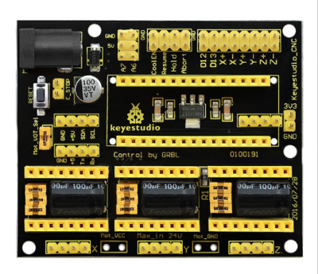
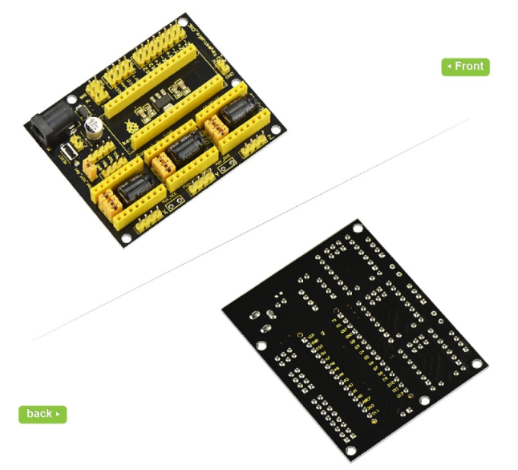
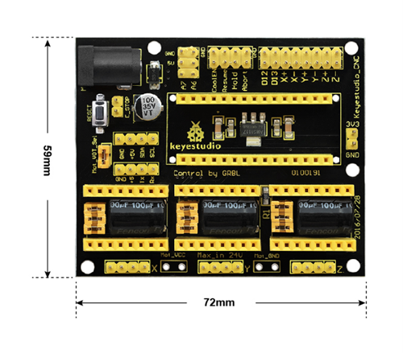
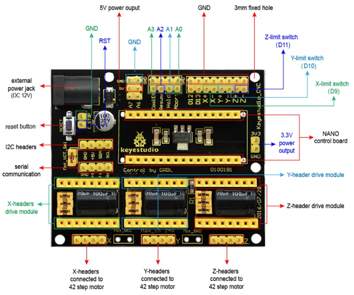

# KS0152 keyestudio CNC Shield V4

## 1. Introduction

keyestudio CNC shield V4 is used as driving shield for engraving machines, fully compatible with NANO control board . So you just need to stack the Nano board onto the shield when using.

It has total 3-way pin slots for stepper motor drive modules (Not Included) to drive 3-channel stepper motors.

Each stepper motor only needs 2 IO ports, so 6 IO ports is enough to manage 3 stepper motors, very easy to use. This shield can make quick work for managing stepper motors in your project.

To easily debug the operating mode of stepper motor driver board, there are 3 jumper caps under each pin slots. You can set the working mode by plugging or unplugging the jumper cap.

For example, connect the A4988 to the shield, unplug three jumpers, it is in full-step mode; if plug all the jumpers, it is 16-subdivision working mode.

Different kinds of interfaces are brought out on this shield, so you can connect some external devices as you like.

## 2. Check out these awesome specifications

- NANO control board compatible
- Supports the software GrblController361Setup
- Can drive the X/Y/Z-axis stepper motors
- Control the drive module via jumper cap. (**Note:** If connect the A4988, unplug three jumpers, as full-step mode; if plug the jumpers, 16-subdivision working mode.)
- Comes with three 4pin headers of 2.54mm pitch for 42 step motor connection.
- You can directly plug 3 stepper motor drive modules into this shield, default X_STP (connected to D2); X_DIR (D5); Y_STP (D3); Y_DIR(D6); Z_STP (D4); Z_DIR(D7).
- The enabled port (EN) of all drive modules has been connected to D8.
- Can supply the power for 3 stepper motor drive modules and Nano board via an external power jack (DC 12V).
- Other communication ports, like the serial communication, I2C communication.

## 3. Technical Detail

- Dimensions: 72mm x 59mm x15mm
- Weight: 31g

## 4. Pinout Instructions

## 5. Using Method

When using this shield, on the hardware, you need to use it with the control board (Nano board ), the drive board (such as A4988), the motor (42 stepper motor) and others. And you need to burn the firmware to the control board. So need to use the software Arduino IDE, and the special upper computer software, such as GrblController361Setup software.